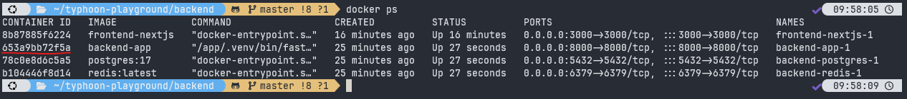
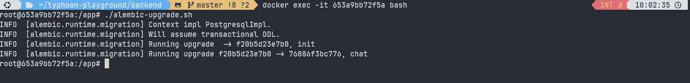
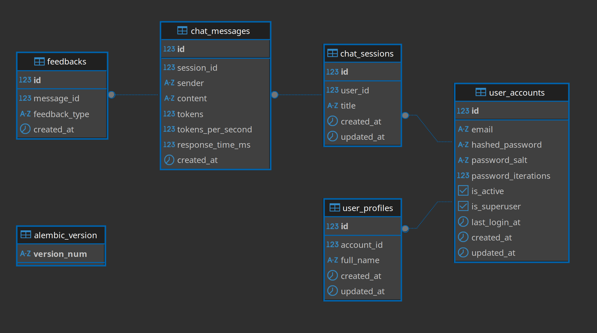
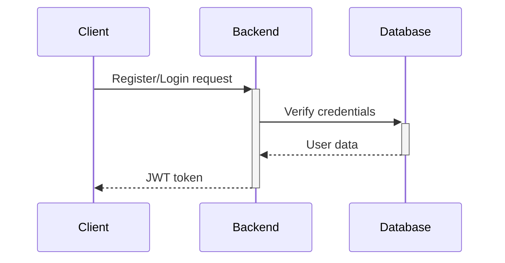
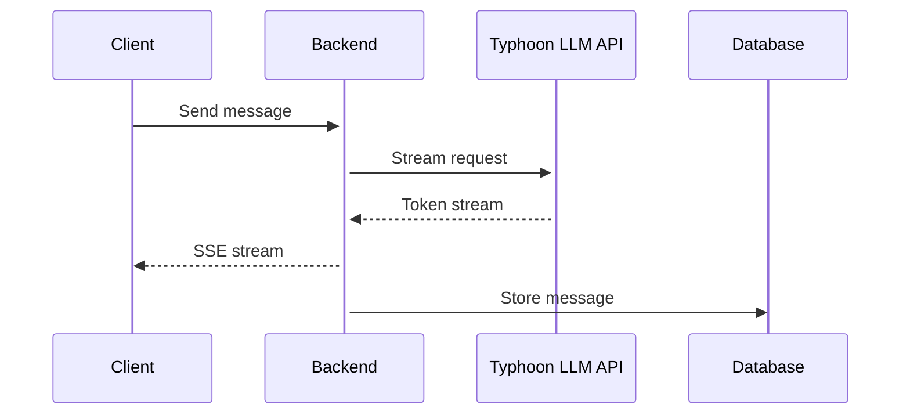

# 🌪️ Typhoon Playground

**Notice:** This is a clone of the Typhoon Playground project, created for educational and demonstration purposes. This is not the official implementation created or maintained by any organization.

Welcome to **Typhoon Playground**, an example project demonstrating how to use **Next.js** (App Router) with **FastAPI** to build a Large Language Model (LLM) Chat UI connected to the Typhoon model. This project showcases best practices and a well-structured codebase, leveraging cutting-edge tools and libraries to provide optimal performance, maintainability, and developer productivity.

## 🎥 Quick Demo

To get a better understanding of how the Typhoon Playground works, check out our quick demo video:

<video src="https://github.com/user-attachments/assets/fa18b4ca-8468-4947-b865-53ee23f23073" width="300"> 
</video>

## 📚 Table of Contents

- [🌪️ Typhoon Playground](#️-typhoon-playground)
  - [🎥 Quick Demo](#-quick-demo)
  - [📚 Table of Contents](#-table-of-contents)
  - [🌐 Frontend](#-frontend)
    - [Frameworks \& Dependencies](#frameworks--dependencies)
  - [🔙 Backend](#-backend)
    - [Frameworks \& Dependencies](#frameworks--dependencies-1)
  - [🗄️ Database](#️-database)
  - [🚀 Getting Started](#-getting-started)
    - [Prerequisites](#prerequisites)
    - [Running the Project](#running-the-project)
  - [Let's Chat! 💬](#lets-chat-)
  - [ℹ️ Additional Information](#ℹ️-additional-information)
  - [📄 License](#-license)
- [Typhoon Playground Architecture](#typhoon-playground-architecture)
  - [System Overview](#system-overview)
  - [Architecture Design](#architecture-design)
    - [Frontend Architecture (Next.js)](#frontend-architecture-nextjs)
      - [Key Components:](#key-components)
    - [Backend Architecture (FastAPI)](#backend-architecture-fastapi)
      - [Key Components:](#key-components-1)
  - [DB Schema](#db-schema)
  - [Data Flow](#data-flow)
  - [Security Measures](#security-measures)
  - [Performance Optimizations](#performance-optimizations)
  - [Deployment](#deployment)

## 🌐 Frontend

### Frameworks & Dependencies

The frontend of Typhoon Playground is built with the following top-tier frameworks and libraries:

1. **Next.js (v15.1.2)** 🌟
   - A powerful React framework for building fast and user-friendly web applications.
2. **Tailwind CSS (v3.4.1)** 🎨
   - A utility-first CSS framework for rapidly building custom user interfaces.
3. **React Query (@tanstack/react-query v5.62.8)** 🔄
   - Provides powerful tools for data fetching, caching, and synchronization in React applications.
4. **Headless UI (@headlessui/react v2.2.0)** 🛠️
   - Completely unstyled, fully accessible UI components for React.
5. **Zustand (v5.0.2)** 🐻
   - A small, fast, and scalable bearbones state-management solution.

Additional noteworthy dependencies include **clsx**, **crypto-js**, **date-fns**, and **react-icons**.

## 🔙 Backend

### Frameworks & Dependencies

The backend of Typhoon Playground utilizes the following top frameworks and libraries:

1. **FastAPI** 🚀
   - A modern, fast (high-performance) web framework for building APIs with Python 3.12 based on standard Python type hints.
2. **UV (v0.1-mini)** ⚡
   - A lightning-fast Python package installer written in Rust, significantly speeding up installations and dependency resolutions.
3. **SQLAlchemy (v2.0.36)** 🗄️
   - A powerful ORM for Python, providing full power and flexibility of SQL.
4. **Alembic (v1.14.0)** 🔄
   - A lightweight database migration tool for SQLAlchemy.
5. **Ruff (v0.8.4)** 🦺
   - A fast Python linter written in Rust, supporting auto-fixing and easy configuration.

Other essential dependencies include **Asyncpg**, **Python-dotenv**, **Pydantic-settings**, and **LangChain**.

## 🗄️ Database

Typhoon Playground uses **PostgreSQL (v17)** as its primary database, ensuring robust performance and reliability. Additionally, **Redis** is integrated for caching and other high-speed operations.

## 🚀 Getting Started

### Prerequisites

Before running the project, ensure you have the following installed:

- **Docker**: [Install Docker](https://docs.docker.com/engine/install/) (optional but recommended for consistent environments).

### Running the Project

To quickly run the Typhoon Playground project, follow these steps using two terminal windows:

1. **Set Up Environment Variables:**
   
   First, copy the example environment variables file and replace the necessary variables. For the Typhoon API token, you need to obtain it from <https://playground.opentyphoon.ai/api-key>.

   ```bash
   cd typhoon-playground
   cp ./backend/.env.example ./backend/.env
   ```

2. **Start the Frontend:**
   
   In the first terminal, navigate to the `frontend` directory and run:

   ```bash
   docker compose -f frontend/docker-compose.yaml --project-directory frontend up --build
   ```

3. **Start the Backend:**
   
   In the second terminal, navigate to the `backend` directory and run:

   ```bash
   docker compose -f backend/docker-compose.yaml --project-directory backend up --build
   ```

4. **Database Migrations** 🗄️: (Do this on first-time setup!)
   
   For the first-time setup, perform the following steps:

   - **List Running Containers:**
     
     ```bash
     docker ps
     ```
   
   - **Find Backend Container ID:**
     
     Locate the container ID for `backend-app` from the list.
   

   - **Execute Alembic Migrations:**
    
     
     ```bash
     docker exec -it <container-id> bash
     ./alembic-upgrade.sh
     ```
     
     Replace `<container-id>` with the actual ID of your backend container.
    


5. **Access the Application:**
   
   - Frontend: [http://localhost:3000](http://localhost:3000) 🌐
   - Backend API: [http://localhost:8000](http://localhost:8000) 🔗

## Let's Chat! 💬
1. Open the frontend at [http://localhost:3000](http://localhost:3000)
2. Create new account
3. Login
4. Start chatting!

## ℹ️ Additional Information

- **CORS Configuration:** 🔒
  
  The backend is configured with CORS middleware to allow requests from `http://localhost` and `http://localhost:3000`.

- **Testing:** 🧪
  
  The project includes tests for the backend using **Pytest** and **SQLAlchemy**. Run tests using:

  ```bash
  uv run pytest
  ```

- **Linting & Formatting:** ✍️
  
  - **Ruff** is used for linting the backend code.
  - **Prettier** with the **prettier-plugin-tailwindcss** is used for formatting the frontend code.
  - **ESLint** is configured for TypeScript and Next.js with custom rules.

- **Environment Variables:** 🌱
  
  Copy the example environment variables before running the project:

  ```bash
  cp .env.example .env
  ```

- **Docker Configuration:** 🐳
  
  The project uses Docker for containerization, ensuring consistent environments across development and production.

## 📄 License

This project is licensed under the MIT License - see the [LICENSE.md](LICENSE.md) file for details.

Copyright (c) 2024 Sirawat Soksawatmakin. All rights reserved.

The author(s) of this software are not responsible for any damages, losses, or liabilities that may arise from the use of this software. Use at your own risk.

---
# Typhoon Playground Architecture

## System Overview

The Typhoon Playground is a full-stack web application built with Next.js and FastAPI, enabling users to interact with LLM models through a modern, responsive interface.

## Architecture Design

### Frontend Architecture (Next.js)

```
frontend/
├── src/
│   ├── components/    # React components using Atomic Design
│   │   ├── atoms/     # Basic building blocks
│   │   ├── molecules/ # Combinations of atoms
│   │   ├── organisms/ # Complex components
│   │   └── templates/ # Page layouts
│   ├── store/         # Global state management (Zustand)
│   ├── hooks/         # Custom React hooks
│   ├── services/      # API integration
│   ├── types/         # TypeScript interfaces
│   └── utils/         # Helper functions
```

#### Key Components:
1. **Authentication**
   - Handled via AuthModal component
   - JWT token storage in Zustand store
   - Protected routes implementation

2. **Chat Interface**
   - Real-time streaming using SSE (Server-Sent Events)
   - Token counting and speed metrics
   - Feedback system (upvote/downvote)
   - Model selection dropdown
   - Model parameters, stored in Zustand store

> **To Improvement Note:**
>  - Responsive design
>  - Handle error state
>  - Optimize server components (SSR)
>  - Add Suspense


### Backend Architecture (FastAPI)

```
backend/
├── src/
│   ├── app/
│   │   ├── api/          # API endpoints
│   │   ├── core/         # Core functionality
│   │   ├── db/           # Database models
│   │   └── middleware/   # Custom middleware
└── tests/                # Unit tests
```

#### Key Components:
1. **Authentication System**
   - JWT-based authentication
   - Redis token caching
   - Password hashing with PBKDF2

2. **Database Design**
   - PostgreSQL with async driver
   - SQLAlchemy ORM
   - Alembic migrations

3. **Chat System**
   - Streaming response handling
   - Message history storage
   - Feedback tracking
   - Session management

> **To Improvement Note:**
>  - Add logging
>  - Add system metrics monitoring
>  - DB sharding, read replica, and failover
>  - DB partitioning (Shard by user_id)
>  - DB indexing

## DB Schema



## Data Flow

1. **Authentication Flow**


2. **Chat Flow**


## Security Measures

1. **Authentication**
   - JWT with short expiration
   - PBKDF2 password hashing

2. **API Security**
   - CORS configuration
   - Input validation
   - 
> **To Improvement Note:**
>  - Add refresh token mechanism
>  - Add rate limiting
>  - Store token in Cookie instead of Local Storage and enable secure flag HTTPOnly

## Performance Optimizations

1. **Frontend**
   - React Query for caching
   - Optimistic updates

2. **Backend**
   - Async database operations
   - Redis caching

> **To Improvement Note:**
>  - Add Lazy loading

## Deployment

Uses Docker Compose with three main services:
- Frontend (Next.js)
- Backend (FastAPI)
- Database (PostgreSQL)